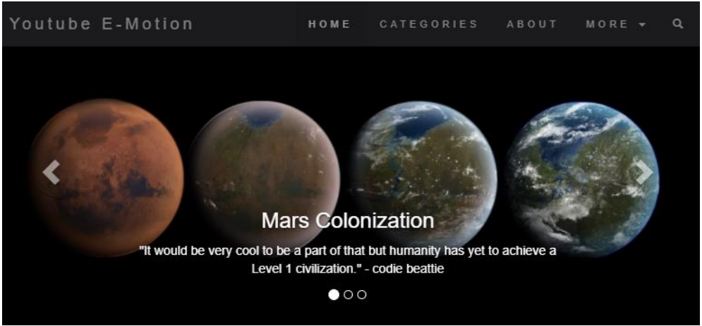

# YouTube_E_Motion
YouTube E-motion is a Flask dashboard which  displays the results of sentiment analysis performed on YouTube comments related to controversial technologies. It also proves that an analysis of the polarity of comments in order to identify their trends can provide a clear picture of the influence that new technologies have on potential customers.

